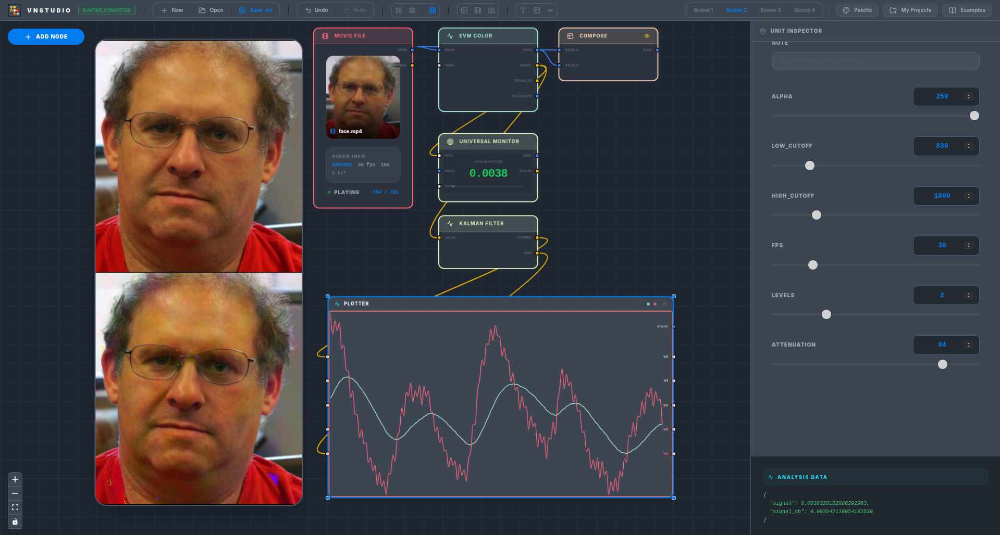

# VisionNodes Studio

**VisionNodes Studio** is a node-based development environment designed for rapid prototyping of Computer Vision and AI pipelines. Built for researchers, engineers, and students, it allows you to construct complex real-time workflows visually, without writing boilerplate.

<p align="center">
  
</p>

<p align="center">
  
</p>

---

## 🌐 Official Website

**[Visit the VisionNodes Studio Website](https://nikos-unilasalle.github.io/VisionNodes/)** for the complete Node Wiki, Community Gallery, tutorials, and pre-compiled binaries for your operating system.

---

## 🎯 What is VisionNodes?

VisionNodes abstracts the complexity of computer vision pipelines into atomic, composable units. It is designed to accelerate the hypothesis-to-result cycle in scientific research and engineering workflows:

- **For Researchers & Engineers**: Quickly test algorithms, evaluate state-of-the-art models (YOLOv11, MediaPipe, DeepSORT), and perform quantitative analysis (Watershed Segmentation, Eulerian Video Magnification, Optical Flow) in real time. Once your visual pipeline is validated, **export your entire workflow to a standalone Python script** for seamless integration into your production environments.
- **For Educators & Students**: Demystify complex AI and computer vision concepts. Build interactive, live demonstrations of algorithms to present at international conferences, colloquia, or use in the classroom.
- **For Developers**: Extend the software endlessly. Drop a single `.py` file into the `engine/plugins/` directory to create a custom node instantly, exposing typed inputs, outputs, and lifecycle hooks with zero build steps.

---

## 💻 Manual Installation (Developer Guide)

VisionNodes Studio is built on a modern stack: **React / Vite / Tailwind** (Frontend), **Tauri / Rust** (Desktop Shell), and **Python / OpenCV / PyTorch** (Backend Engine).

### Prerequisites

You will need the following dependencies installed on your system:
- **Node.js** (v18+) and **npm**
- **Rust** (`rustup default stable`)
- **Python** (3.10+)

*(On Linux, install WebKitGTK and base development packages depending on your distribution. For example, on Arch Linux: `sudo pacman -S webkit2gtk-4.1 gtk3 base-devel`).*

### Setup and Build

1. **Clone the repository:**
   ```bash
   git clone https://github.com/Nikos-Unilasalle/VisionNodes.git
   cd VisionNodes
   ```

2. **Install dependencies and setup the Python environment:**
   ```bash
   npm run setup
   ```
   *This command installs Node packages and creates a local Python virtual environment (`.venv`) with all required ML/CV packages automatically.*

3. **Launch in development mode:**
   ```bash
   npm run studio
   ```

4. **Build for production:**
   ```bash
   npm run tauri build
   ```

*(Note for Linux Wayland users: If you experience a white screen upon launch, start the application with `WEBKIT_DISABLE_DMABUF_RENDERER=1 npm run studio`)*.

---

## 🤝 Contributing

VisionNodes is open-source and welcomes contributions. To contribute:
1. Fork the repository.
2. Add custom nodes to `engine/plugins/`, create new `.vn` examples in `public/examples/`, or improve the React frontend.
3. Open a Pull Request with a clear description of your changes and additions.

---

## 📄 License

MIT License. Free to use for educational and research purposes.
