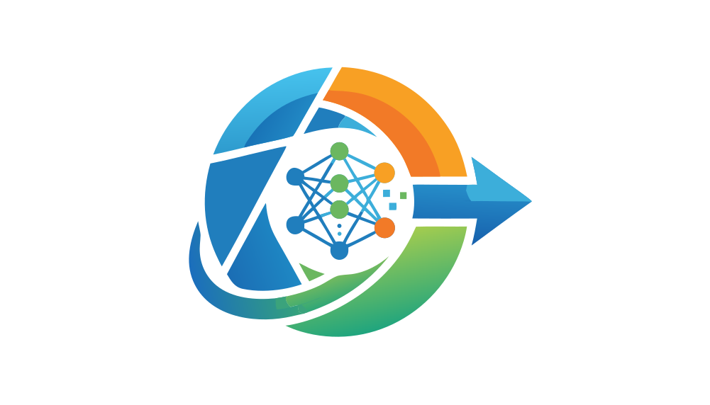
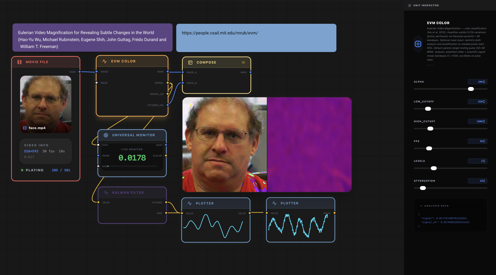

# VisionNodes Studio

**VisionNodes** is a node-based development environment for rapid prototyping of Computer Vision and AI pipelines. Every node is a processing unit; connect them to build complex real-time workflows without writing boilerplate.

<p align="center">
  
</p>

<p align="center">
  
</p>

---

## Core Principles

- **Real-time execution** — parameter changes are reflected instantly on the live video stream.
- **AI-native** — deep integration with YOLO, MediaPipe, and other state-of-the-art models.
- **Scientific precision** — quantitative analysis tools: Watershed, Marker Analysis, EVM, Plotter.
- **Extensible by design** — drop a `.py` file in `engine/plugins/` to add a custom node.
- **Visual programming** — graph-based UI powered by ReactFlow, running as a native desktop app via Tauri.

---

## Node Categories

### Input
- **Webcam** — live camera feed with device selection.
- **Movie File** — video playback with scrubbing, trim range, and frame index output.
- **Image** — static image input.
- **Solid Color** — generates a flat-color image at a given resolution.
- **Number** — outputs a constant scalar value.
- **String Input** — outputs a constant string value.

### AI & Analysis
- **YOLO Object Detection** (YOLOv11/Ultralytics) — multi-class detection with confidence threshold and model size selection.
- **Face Mesh** (MediaPipe) — 478-point facial landmark detection with per-face dictionary output.
- **Hand Tracking** (MediaPipe) — 21-point hand landmark detection.
- **Pose Estimation** (MediaPipe) — full-body pose with 33 keypoints.
- **Optical Flow** (Farneback) — dense motion field computation.
- **Universal Monitor** — real-time scalar and list display for any data stream.
- **Scientific Plotter** — live time-series chart with configurable history buffer.

### Tracking
- **SORT** — Simple Online and Realtime Tracking (Kalman + Hungarian algorithm). High-speed ID persistence.
- **DeepSORT** — SORT extended with CNN visual re-identification embeddings. Robust across occlusions.
- **Track Visualizer** — renders tracks with colored bounding boxes by ID, configurable trail length, class labels, fill alpha, and centroid point (radius and color).
- **Track Point** — extracts the x/y coordinates of a specific landmark from a face or hand dictionary.
- **Track Line / Track Polygon** — geometric drawing primitives driven by landmark data.

### Logic & Control
- **Compare** — compares two scalars with ==, !=, >, <, >=, <= and outputs a boolean.
- **Gate** — AND, OR, XOR, NOT operations on boolean inputs.
- **Switch** — routes one of two inputs based on a boolean condition.
- **Presence** — checks whether a list is non-empty or a value is non-null.
- **Collect** — accumulates values into a list when a condition is true. Two trigger modes:
  - *Every True frame*: appends on every frame where condition is true.
  - *Rising edge only*: appends once at the False-to-True transition.
  - Includes a Reset trigger and an Export CSV trigger with configurable output folder.
- **Python Script** — executes arbitrary Python with access to NumPy and OpenCV. Persistent `state` dict between frames. Four inputs (a, b, c, d), five typed outputs.

### Math
- Add, Subtract, Multiply, Divide, Power, Clamp, Distance (between two coordinate dicts).
- All operations accept scalar inputs or fall back to a constant parameter.

### Strings
- Concat, Split, Case (upper/lower), Length, String Input.

### Drawing
- **Draw Overlay** — composites graphic elements (points, lines, rectangles) over an image.
- **Draw Text** — OpenCV text rendering with variable injection (`{a}`, `{b}`...).
- **Draw Point / Line / Rect** — define graphic primitives with RGB color and thickness.
- **Blend Images** — alpha compositing of two images.
- **Blend Modes** — Screen, Multiply, Overlay, Difference, and more.

### Geometry
- **Flip** — horizontal or vertical.
- **Resize** — to fixed dimensions or by scale factor.
- **Rotate** — by angle with optional crop.
- **Warp Affine** — applies a 2x3 affine matrix (usable with Python Script to animate transforms).
- **Perspective Warp** — four-point perspective correction.
- **Auto Cropper** — crops the image to the bounding box defined by a coordinate dict.
- **Offset** — translates pixel coordinates.

### Filters & CV
- **Brightness / Contrast** — linear adjustment.
- **Color Mask** — HSV or RGB range filter with eyedropper support. Outputs a binary mask.
- **Threshold** — simple and adaptive (Otsu, Gaussian).
- **Morphology** (basic and advanced) — erode, dilate, open, close with configurable kernel.
- **Blur** (Gaussian), **Canny** edge detector, **Gray**, **Invert**.
- **Distance Transform** — produces a distance map from a binary mask. Used in Watershed pipelines.
- **Connected Components** — labels distinct regions and outputs a markers image.
- **Marker Filter** — removes markers outside a configurable area range.
- **Watershed** — marker-controlled image segmentation with region colorization and boundary rendering.
- **Marker Analysis** — extracts count, area, centroid, and intensity for each segmented region.
- **Sobel Edge**, **Noise** (Gaussian, Salt-Pepper, Speckle), **Pixelate**, **Glitch FX**.
- **Channel Ops** — split and recombine BGR channels.
- **Background Subtraction** (MOG2) — foreground/background separation.
- **Background Removal** (AI-based segmentation).
- **Feature Detection** — Harris corners, ORB keypoints, Feature Matcher.
- **ROI Polygon** — interactive mask for restricting analysis to a drawn region.

### Signals
- **Kalman Filter** (1D) — smooths a noisy scalar stream.
- **EVM Color** (Eulerian Video Magnification, Wu et al. 2012) — amplifies subtle color changes (e.g., skin tone for pulse detection).
- **EVM Motion** — amplifies small motion.

### Data Utilities
- **Data Inspector** — displays raw data flowing through any connection. Supports key filtering for dicts and lists-of-dicts.
- **Coord Splitter / Combine** — converts between `{x, y, w, h}` dicts and individual scalars.
- **Dict Get** — extracts a field from a dict by key.
- **Group Dicts** — merges up to four dicts into a list.
- **List Selector** — selects a single item from a list by index.
- **On Each** — maps a processing branch over every element of a list.

### Output
- **Display** — final rendered output shown in the preview window.
- **CSV Export** — records up to eight connected values per frame to a timestamped CSV file. Toggle to start/stop recording.
- **Movie Export** — records the processed stream to an MP4 file.
- **Snapshot** — captures a single frame as a PNG and adds it as an Image node.
- **OCR** (EAST + Tesseract) — detects and reads text regions in an image.

### Canvas Utilities
- **Canvas Frame** — visual grouping container for organizing subgraphs.
- **Canvas Reroute** — pass-through node for routing edges cleanly across the canvas.

---

## Interface

- **Palette selector** — choose from multiple color themes applied globally to all nodes.
- **Node colorization** — each node can be assigned an individual color from the active palette.
- **Grid snapping** — optional snap-to-grid for precise layout.
- **Alignment tools** — align and distribute selected nodes horizontally or vertically.
- **Preview window** — resizable floating window showing the output of the selected node. Position and size are persisted between sessions.
- **Right panel** — shows parameters of the selected node. All parameters update in real time.

---

## Examples Library

Examples are stored as `.vn` files in `public/examples/` and listed in `manifest.json`. To add a new example, save a workflow from within VisionNodes, place the `.vn` file in that folder, and add an entry to `manifest.json`.

Included examples:
- Smile Detector (MediaPipe face mesh, mouth corner distance, conditional frame collection, CSV export)
- YOLO Object Detection (static image)
- SORT Multi-Object Tracking (webcam)
- DeepSORT Multi-Object Tracking (webcam)
- Galets Segmenter (Watershed pipeline on a pebble image)
- Sprint Race Tracker (SORT on a video, cumulative runner count)
- EVM Pulse Detector (Eulerian Video Magnification, Wu et al. 2012)
- Interactive Magic Painter (hand landmark as a virtual brush)
- Ghost Motion Trail (MOG2 + temporal blend)
- Feature Matching (ORB + Brute-Force Matcher)
- Warp Affine: Animated Transform (Python-driven affine matrix)
- Python: Image Stats (brightness measurement, custom script)
- Movement Analysis (MOG2 + contour detection)
- Harris Corner Detection
- OCR Scanner (EAST + Tesseract)

---

## Developer Guide: Creating Custom Nodes

Any `.py` file placed in `engine/plugins/` is automatically discovered and loaded at startup.

```python
from __main__ import vision_node, NodeProcessor

@vision_node(
    type_id='my_filter',
    label='My Custom Filter',
    category='cv',
    icon='Zap',
    description='Applies a custom operation to an image.',
    inputs=[{'id': 'image', 'color': 'image'}],
    outputs=[{'id': 'main', 'color': 'image'}],
    params=[
        {'id': 'strength', 'label': 'Strength', 'min': 0, 'max': 100, 'step': 1, 'default': 50}
    ]
)
class MyNode(NodeProcessor):
    def process(self, inputs, params):
        img = inputs.get('image')
        if img is None:
            return {'main': None}
        strength = int(params.get('strength', 50))
        # OpenCV / NumPy / AI logic here
        return {'main': img}
```

**Parameter types**: slider (default, with `min`/`max`/`step`), `number` (free numeric input), `string` (text field), `enum` (dropdown with `options` list), `toggle` (boolean switch), `trigger` (momentary button), `bool`.

**Data types** (for `color` in inputs/outputs): `image`, `scalar`, `boolean`, `list`, `dict`, `mask`, `string`, `any`.

## 🐧 Linux Installation Guide

VisionNodes works on Linux (tested on Arch Linux with KDE Wayland). A few extra steps are required compared to macOS.

### Prerequisites

```bash
# Arch Linux
sudo pacman -S nodejs npm rustup webkit2gtk-4.1 gtk3 base-devel

# Ubuntu / Debian
sudo apt install nodejs npm curl build-essential libwebkit2gtk-4.1-dev libgtk-3-dev libayatana-appindicator3-dev librsvg2-dev
```

For Rust:
```bash
rustup default stable
```

### Installation

```bash
git clone https://github.com/Nikos-Unilasalle/VisionNodes
cd VisionNodes
npm run setup
```

### Launch

```bash
npm run studio
```

### Known Issues & Fixes

#### White screen on Wayland / WebKitGTK 2.48+

WebKitGTK 2.48 and above uses a new DMA-BUF renderer that causes a white screen on many Linux setups. The `npm run studio` script already sets the required environment variable (`WEBKIT_DISABLE_DMABUF_RENDERER=1`), but if you launch the app another way, set it manually:

```bash
WEBKIT_DISABLE_DMABUF_RENDERER=1 npm run tauri dev
```

If the issue persists after an interrupted or failed first launch, clear the WebKit cache:

```bash
rm -rf ~/.local/share/com.visionnodes.app/WebKitCache
rm -rf ~/.local/share/com.visionnodes.app/CacheStorage
```

#### Camera not detected

Linux enumerates cameras differently from macOS. If the webcam node shows a black frame, open the node's settings panel and set **Device Index** to `0`. You can verify your camera index with:

```bash
v4l2-ctl --list-devices
```

#### Port already in use (8765)

If you force-quit the app, the Python engine may keep running. `npm run studio` handles this automatically. If you still get a port error, kill it manually:

```bash
ss -tlnp | grep 8765   # find the PID
kill -9 <PID>
```

---

## 🤝 Fork & Contribute

Stateful nodes (requiring memory between frames) inherit from `NodeProcessor` normally and use instance variables — the engine preserves one instance per node per session.

---

## Tech Stack

- **Frontend**: React, ReactFlow, Vite, Tailwind CSS, Framer Motion.
- **Backend engine**: Python 3.10+, OpenCV, PyTorch, MediaPipe, asyncio WebSocket server.
- **Desktop shell**: Rust + Tauri for native OS integration (file dialogs, window management).

---

## Contributing

VisionNodes is open-source. To contribute:

1. Fork the repository.
2. Add nodes to `engine/plugins/`, examples to `public/examples/`, or improve the frontend.
3. Open a pull request with a clear description of what was added and why.

Bug reports and feature requests are welcome via GitHub Issues.

---

## License

MIT License. Free to use for educational and research purposes.
