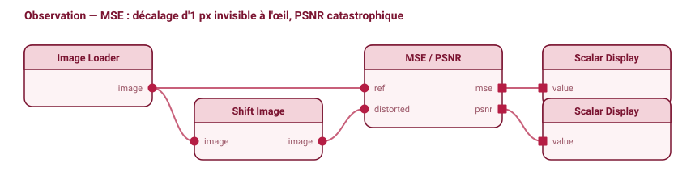
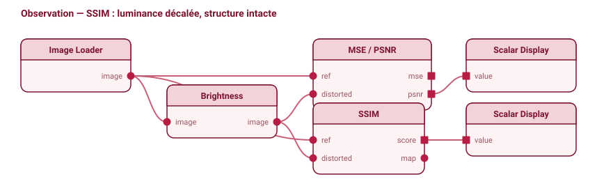
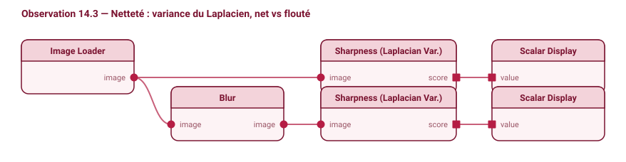

# Chapitre 14 — Bonne image, pour qui ? la mesure de qualité


*Demander si une image est « bonne » n'a pas de sens sans dire bonne pour qui. Chaque juge a ses critères — et ne voit que les défauts que ces critères l'autorisent à voir.*

---

Demander si une image est « bonne » n'a pas de sens sans préciser : bonne *pour qui*, et *à comparer à quoi* ? Une compression qui décale uniformément la luminance de quelques niveaux est catastrophique pour un capteur qui somme des pixels, mais invisible pour un œil humain. Un flou léger ruine une page d'OCR mais passe inaperçu sur une photo de paysage. Une texture inventée par un réseau génératif reçoit le pire score pixel possible alors que les observateurs humains la préfèrent à l'image floue fidèle. Ce chapitre construit les métriques de qualité dans l'ordre où elles se dotent d'un modèle d'observateur de plus en plus explicite : la fidélité pixel à pixel (MSE/PSNR), qui ne modélise presque rien ; la similarité structurelle (SSIM), qui code à la main une approximation de la vision humaine ; l'entropie et la netteté, qui se passent de toute référence ; enfin les métriques apprises (LPIPS), qui ajustent l'observateur sur des jugements humains réels.

Le fil du chapitre tient en une phrase : **mesurer la qualité d'une image, c'est postuler un observateur et déclarer ce qui le dérange.** Aucune métrique n'est neutre. Chacune incarne un modèle de qui regarde — un comparateur de pixels indépendants, une vision humaine approximée, un détecteur de mise au point sans mémoire de l'original, un réseau calibré sur des préférences — et ne pénalise que les dégradations que ce modèle juge importantes, restant délibérément aveugle aux autres. Ce que la métrique punit, c'est ce que son observateur perçoit ; ce qu'elle ignore, c'est ce qu'il tolère.

La qualité d'image recoud des outils dispersés dans tout le livre. Le MSE est le carré de la distance L2 par pixel (chapitre 3) ; le terme « structure » de SSIM est une corrélation (chapitre 3) ; le flou est un filtre passe-bas (chapitres 5 et 10) ; la netteté est une énergie haute-fréquence mesurée par le Laplacien ou Sobel (chapitre 6) ; l'entropie d'image est l'entropie du premier ordre du chapitre 13, avec le même angle mort ; LPIPS compare dans un espace de descripteurs appris. Le couple « ce qui est puni / ce qui est toléré » prolonge le fil du chapitre 3 (« une distance déclare ce qui compte ») et du chapitre 4 (« aucune métrique unique ne capture tout »).

### Un peu de vocabulaire avant de commencer

*   **Erreur quadratique moyenne (MSE)** : La moyenne des écarts d'intensité au carré entre les pixels de l'image de référence et ceux de l'image dégradée.
*   **PSNR** : Une mesure de fidélité exprimée en décibels (échelle logarithmique) comparant la puissance maximale du signal à la puissance du bruit (le MSE).
*   **Similarité structurelle (SSIM)** : Une métrique mesurant la conservation de la luminance, du contraste et de la structure géométrique, plus proche de la perception humaine.

---

## 14.1 — Modèles de bruit (Poisson–Gauss) : modéliser la dégradation physique

> *Compter des photons sous une averse de pluie tout en écoutant le grésillement électrique du capteur*

On parle du bruit comme d'un voile gris uniforme posé sur l'image. C'est faux deux fois. Le bruit dominant en imagerie n'est pas additif et n'est pas uniforme : il **dépend du signal**, parce qu'il vient pour l'essentiel du comptage des photons eux-mêmes. Une zone claire est, en valeur absolue, plus bruitée qu'une zone sombre. Le fil de la section est là : un modèle de bruit est un a priori sur la façon dont la mesure s'écarte de la vérité, et le débruiteur que l'on choisit ne fait qu'épouser ce modèle. Tout le reste du chapitre mesure des écarts ; ici on dit de quelle nature ils sont.

### L'intention
Nous voulons modéliser mathématiquement le bruit physique d'un capteur d'images. L'objectif est d'exprimer comment la valeur mesurée de chaque pixel fluctue autour de sa vraie clarté moyenne, afin de calibrer nos filtres de débruitage et d'estimer la qualité réelle des mesures.

### La forme recherchée
Le bruit physique provient de deux sources distinctes :
1. La nature discrète de la lumière : le capteur compte des photons comme on compterait des gouttes de pluie dans un seau. Si l'on augmente la clarté, la fluctuation absolue augmente, mais la fluctuation relative diminue. La forme de la variance de ce bruit doit donc être directement proportionnelle au signal moyen (`Var ∝ signal`).
2. L'électronique du capteur : la lecture du signal ajoute une perturbation fixe, présente même dans l'obscurité complète. La variance de ce bruit de lecture est constante, indépendante de la lumière.

En combinant ces deux comportements, la variance globale de la mesure doit suivre une droite par rapport à la moyenne : une ordonnée à l'origine (plancher de lecture) et une pente positive (bruit de grenaille). La forme de la courbe variance-moyenne est donc affine.

### Les formules
Le nombre de photons reçus suit une loi de Poisson, caractérisée par une variance égale à sa moyenne. Le bruit de lecture suit une loi gaussienne de moyenne nulle et de variance constante `σ_r²` :
```
Bruit de grenaille (Poisson) : P(k) = λᵏ e^(−λ) / k!   avec  Var[k] = λ (signal)
Bruit de lecture (Gauss)     : n_lecture ~ N(0, σ_r²)
```
En additionnant les deux variances indépendantes, on obtient le modèle de Poisson-Gauss, matérialisé par la **loi de variance affine** :
```
σ²(I) = a · I + b
```
Où `I` est l'intensité du pixel, `a` représente le gain (part Poisson) et `b` le plancher électronique (part lecture). ∎

### Ce qu'il mesure, et son angle mort
Ce modèle mesure la dispersion des pixels. Il montre que le rapport signal sur bruit (SNR) croît comme la racine carrée du signal moyen (`SNR = √λ`) : doubler l'exposition ne multiplie le SNR que par `√2`. Son angle mort classique est de croire qu'une image sombre est « propre » parce qu'une fluctuation absolue faible y réside ; en réalité, son signal est si faible que son SNR est désastreux.

### Exemple
Soit un capteur avec un bruit de lecture de `σ_r = 5 e⁻` (variance `25 e⁻²`). Comparons deux pixels de clartés moyennes différentes :

| Zone | Signal `λ` (e⁻) | Variance totale (λ + σ_r²) | Écart-type `σ` | Rapport SNR (λ/σ) | Régime dominant |
|---|---|---|---|---|---|
| Claire | 900 | 900 + 25 = **925** | 30,4 | **29,6** | Grenaille (900 ≫ 25) |
| Sombre | 16 | 16 + 25 = **41** | 6,4 | **2,5** | Lecture (25 > 16) |

Dans la zone claire, le bruit de lecture est négligeable ; le SNR vaut environ `√900 = 30`. Dans la zone sombre, le bruit de lecture dégrade massivement le SNR, qui s'effondre à 2,5 au lieu de `√16 = 4`.

### Dans VNStudio
Canvas : `Image Source` -> `Noise (Gaussian)` -> `Python Node (noise estimation)` -> `Output Display`

### Schéma de nœuds
```
[Signal linéaire λ] ──> [Poisson (grenaille) + Gauss (lecture)] ──> [Image bruitée]
        ──> [Anscombe : Var ≈ 1] ──> [Débruitage gaussien] ──> [Anscombe⁻¹ non biaisé]
[Image inconnue] ──> [MAD des détails fins (ondelette, ch.16)] ──> [σ̂]
```
*Schéma à produire ; script de référence en Annexe 1, §A1‑14.1.*

### Subtilités d'implémentation

#### Stabilisation de variance (Anscombe)
Puisque le bruit dépend du signal, les filtres de débruitage classiques (qui supposent un bruit uniforme) sont mis en défaut. On applique la transformation d'Anscombe pour rendre la variance constante et égale à 1 :
```
f(x) = 2 · √(x + 3/8)
```
On applique ensuite le débruiteur sur `f(x)`, puis on applique l'inverse exact non biaisé de Makitalo-Foi pour revenir à l'échelle d'origine sans noircir les zones sombres.

#### Estimation robuste du bruit
Sur une image inconnue, on estime `σ` à l'aide de l'estimateur de Donoho, en calculant la MAD (chapitre 16) sur les coefficients de détails fins de la décomposition en ondelettes :
```
σ̂ = MAD(coeffs HH) / 0,6745
```
La MAD est insensible aux quelques contours réels et ne mesure que le fond aléatoire.

#### Limitations et espace linéaire
- **Espace linéaire.** Ce modèle de variance n'est valide qu'en espace linéaire. Sur une image avec encodage gamma (sRGB, ch.7), la non-linéarité déforme les fluctuations. Il faut linéariser l'image avant toute estimation.
- **Saturation et clipping.** Le modèle n'est plus valable lorsque les valeurs s'écrasent à 0 ou saturent à la valeur maximale (255) : la variance y chute artificiellement à 0. Ces pixels doivent être exclus.
- **Dématriçage.** Le dématriçage (demosaicing) corrèle spatialement le bruit, ce qui conduit à sous-estimer son écart-type sur ondelettes. L'estimation est plus fiable sur le format RAW.


---

## 14.2 — MSE et PSNR : l'observateur aveugle à la structure

> *Empiler les deux images et noter l'écart de chaque case, sans jamais regarder le motif*



### L'intention

On veut le plus simple des verdicts : de combien l'image dégradée s'écarte-t-elle de l'originale ? Un seul nombre, calculé sans rien supposer de qui regarde. On verra que ce « rien supposer » est lui-même une hypothèse — celle d'un observateur qui ne voit que des pixels.

### La forme recherchée

On empile les deux images l'une sur l'autre, on lit la différence de chaque case du damier, on la met au carré, et on fait la moyenne. C'est l'**erreur quadratique moyenne** (MSE) — à la normalisation près, le carré de la distance euclidienne par pixel (chapitre 3). Le carré n'est pas neutre : une erreur de 10 niveaux pèse 100 fois plus qu'une erreur de 1 niveau, pas 10 fois. Le **PSNR** n'en est qu'un habillage logarithmique, hérité des calculs de rapport signal/bruit : il transforme un rapport (par nature multiplicatif, comme une plage dynamique) en une échelle additive et lisible, où plus haut vaut mieux. Voir la forme *log*, annexe C.

### La formule

```
MSE  = (1/N) Σᵢ (Iᵢ − Îᵢ)²
PSNR = 10·log₁₀(MAX² / MSE)        [dB]
```

N est le nombre de pixels, MAX la valeur maximale représentable (255 en 8 bits, 1,0 en flottant normalisé). On prend pour « puissance du signal » MAX² et pour « puissance du bruit » le MSE ; deux images identiques donnent MSE = 0 et PSNR infini. ∎

### Ce qu'elle mesure, et son angle mort

L'observateur modélisé pose les deux images l'une sur l'autre et somme les écarts au carré, chaque pixel traité indépendamment et à l'identique. Il n'a aucune notion de structure, de voisinage, ni de *où* l'erreur se trouve. D'où deux échecs symétriques : une dégradation globale mais bénigne — léger décalage de luminance, faible désalignement — gonfle le MSE alors que l'œil ne voit rien ; à l'inverse, une atteinte locale mais grave — une lettre effacée en OCR, une micro-fissure sur une pièce — reste noyée dans la moyenne de millions de pixels intacts. Le MSE dit *combien* les valeurs diffèrent en moyenne, jamais *comment* ni *où*.

### Exemple

Patch 2×2 (8 bits), un seul pixel altéré de 8 niveaux :

```
I = [10 10 ; 10 10]   Î = [10 10 ; 10 18]
MSE  = (0 + 0 + 0 + 8²)/4 = 16
PSNR = 10·log₁₀(255²/16) ≈ 36,1 dB   (« bonne » qualité)
```

L'angle mort éclate sur deux dégradations opposées :

```
(a) +1 sur TOUS les pixels (décalage de luminance imperceptible) :
      MSE = 1  → PSNR ≈ 48,1 dB   (« excellent »)

(b) damier 0/255 glissé d'1 pixel (image visuellement identique) :
      presque tout pixel bascule 0↔255
      MSE ≈ 255² = 65025  → PSNR = 0 dB   (« pire cas »)
```

Le cas (b) est la démonstration canonique : une image visuellement *inchangée* — juste décalée d'un pixel — reçoit le pire score possible, parce que l'observateur-MSE compare des positions absolues. Pixel par pixel, tout a changé ; structurellement, rien.

### Subtilité — calculer en virgule, en espace linéaire, et fixer MAX

Quatre points donnent un résultat faux et silencieux. La soustraction doit se faire en **nombres à virgule** : sur des entiers non signés 8 bits, 10 − 200 boucle modulo 256 et produit n'importe quoi. MAX doit correspondre au format (255 en 8 bits, 1,0 en flottant normalisé) : un MSE calculé sur [0, 1] avec MAX = 255 fausse le PSNR de ~48 dB. Le MSE calculé en espace gamma (chapitre 7) ne pèse pas l'erreur physique — il sur-pénalise les tons clairs ; on linéarise d'abord pour une mesure radiométrique. Enfin, en vidéo, la moyenne des PSNR par image diffère du PSNR du MSE moyen (le logarithme n'est pas linéaire) : la convention de moyennage se documente.

### Paramètres opérationnels (VNStudio / Python)

Dans le nœud `PSNR` (ou en Python via `skimage.metrics.peak_signal_noise_ratio`), le calcul du score en décibels repose sur le paramètre opérationnel suivant :

*   **Plage dynamique maximale (`data_range` ou `MAX`)** :
    *   Dans VNStudio, ce paramètre correspond au champ **Dynamic Range (MAX)** ; en Python (scikit-image), il se nomme `data_range` dans la fonction `skimage.metrics.peak_signal_noise_ratio`.
    *   Ce paramètre indique la valeur maximale théorique que peut prendre un pixel. Pour une image classique encodée sur 8 bits sans signe, la valeur est de `255`. Pour une image flottante normalisée entre 0.0 et 1.0, elle est de `1.0`. Veillez à ce que ce paramètre soit correctement configuré dans VNStudio : calculer le PSNR d'une image flottante en laissant `MAX = 255` renvoie une valeur erronée, faussée de près de 48 dB (l'équivalent d'un bruit de fond gigantesque alors que les images sont presque identiques).

### Dans VNStudio

Dans votre canvas :
`Reference` ──┐
             ├──> `PSNR` ──> `Inspector`.
`Degraded` ──┘

Le nœud `PSNR` calcule l'erreur quadratique moyenne pixel par pixel. L'inspecteur affiche le MSE et le PSNR en décibels. Expérimenter en décalant l'image d'un seul pixel via un nœud de translation permet d'observer l'effondrement immédiat du PSNR vers 0 dB, illustrant de façon tangible la sensibilité excessive de cette métrique à la structure absolue.

**Exercice de dépannage :** L'exercice consiste à charger deux images identiques converties au format virgule flottante normalisée entre [0.0, 1.0]. Connecter ces images au nœud `PSNR` et laisser le paramètre **Dynamic Range (MAX)** réglé sur `255` au lieu de `1.0`. Le lecteur constate dans l'inspecteur que la valeur du PSNR s'effondre de près de 48 dB, affichant un score de bruit catastrophique alors que les deux images sont strictement identiques. Cet échec contrôlé démontre l'impact critique du choix de l'échelle de clarté de référence lors du calcul des métriques de bruit.

---

## 14.3 — SSIM : modéliser l'observateur par luminance, contraste, structure

> *Comparer trois choses séparément : la clarté, le contraste, et le dessin*



### L'intention

L'œil ne somme pas des écarts de pixels : il perçoit des structures. Une dérive globale de luminosité sur une photo satellite ne choque pas ; une ligne de texte effacée est catastrophique, même si tous les autres pixels sont parfaits. On veut une mesure qui épouse cette hiérarchie — indulgente sur ce que l'œil tolère, sévère sur ce qui le heurte.

### La forme recherchée

SSIM décompose la ressemblance en trois questions posées localement sur chaque petite fenêtre : la **luminance** (les moyennes sont-elles proches ?), le **contraste** (les écarts-types ?), la **structure** (les motifs sont-ils corrélés ?). Le geste décisif est cette **séparation** : un décalage global de luminosité abîme le terme de luminance mais laisse la structure intacte. Le terme de structure n'est rien d'autre que la corrélation de Pearson entre les deux fenêtres — le cosinus des patchs centrés (chapitre 3). SSIM sous-pondère ainsi exactement les changements que l'œil tolère, là où le MSE les pénalisait à plein.

### La formule

```
l(x,y) = (2μₓμᵧ + c₁)/(μₓ² + μᵧ² + c₁)      luminance
c(x,y) = (2σₓσᵧ + c₂)/(σₓ² + σᵧ² + c₂)      contraste
s(x,y) = (σₓᵧ + c₃)/(σₓσᵧ + c₃)              structure
SSIM = l · c · s
```

Chaque terme a la forme `2ab/(a²+b²)`, qui vaut 1 si et seulement si a = b et décroît sinon. Les constantes c₁, c₂, c₃ (petites, proportionnelles à la plage dynamique) stabilisent les rapports dans les zones uniformes où les dénominateurs frôlent zéro. On calcule SSIM sur des fenêtres gaussiennes 11×11, puis on moyenne sur l'image : le résultat est borné par 1, atteint si et seulement si les images coïncident. ∎

### Ce qu'elle mesure, et son angle mort

L'observateur modélisé juge la similarité structurelle locale, peu sensible aux décalages de luminance et de contraste — un modèle artisanal de la vision humaine. Quatre angles morts. C'est une approximation codée à la main, pas la perception réelle : elle ne capte ni le masquage de texture, ni la couleur (SSIM standard ne travaille que sur la luminance). Elle est mono-échelle — la fenêtre 11×11 confond des flous de niveaux différents, d'où MS-SSIM qui combine plusieurs sous-échantillonnages (le choix d'échelle des chapitres 5 et 6). Comme le MSE, elle suppose les images **recalées** — un décalage d'un pixel abîme la structure. Et elle reste *full-reference* : sans l'original, rien à mesurer.

### Exemple

Reprenons la dégradation que le MSE punissait : un décalage uniforme de +10. Patch de moyenne μₓ = 100, écart-type σₓ = 5 ; on pose ŷ = x + 10, donc μᵧ = 110, σᵧ = 5, et la covariance vaut 25 (corrélation parfaite, structure intacte) :

```
c₁ = (0,01·255)² = 6,50      c₂ = (0,03·255)² = 58,52      c₃ = c₂/2 = 29,26

l = (2·100·110 + 6,50)/(100² + 110² + 6,50) ≈ 0,9955
c = (2·25 + 58,52)/(25 + 25 + 58,52)         = 1,000
s = (25 + 29,26)/(25 + 29,26)                = 1,000

SSIM ≈ 0,9955
```

Pour la **même** dégradation, le MSE donne 100, soit PSNR ≈ 28,1 dB (« médiocre »). Deux verdicts opposés sur un seul décalage de luminosité : l'observateur-MSE crie à la dégradation, l'observateur-SSIM répond « structure intacte, quasi identique ».

### Différence d'implémentation — plage, fenêtre, couleur

La plage dynamique doit être donnée explicitement (255 en 8 bits, 1,0 en flottant) : sans elle, c₁ et c₂ sont calculés sur la mauvaise échelle et le score dérive. Pour retrouver les valeurs de l'article de référence (Wang et al., 2004), on utilise une fenêtre gaussienne (σ = 1,5), pas une fenêtre uniforme. SSIM reste une mesure de luminance : pour la fidélité chromatique, on lui adjoint un ΔE (chapitre 7). Enfin SSIM n'est pas une vraie métrique (pas d'inégalité triangulaire) ; sa version bornée DSSIM = (1−SSIM)/2 sert de coût d'entraînement (chapitre 15), pas de distance.

### Dans VNStudio

Canvas : `Reference` + `Degraded` → `SSIM` → `Output Display`. Le nœud sort le score global **et** la carte locale de SSIM, qui montre *où* siège la dégradation — un avantage décisif sur le PSNR, qui ne livre qu'un scalaire muet sur la localisation.

---

## 14.4 — Entropie d'image : la qualité sans référence

> *Combien de bits pour noter la valeur d'un pixel tiré au hasard*

### L'intention

Jusqu'ici, il fallait l'original pour juger. On veut maintenant mesurer une propriété de l'image **seule**, sans référence — par exemple son contenu informationnel, comme proxy de contraste et d'exposition.

### La forme recherchée

L'entropie de Shannon mesure la « surprise » moyenne. L'image utile est celle d'un chiffreur : combien de bits faut-il en moyenne pour noter la valeur d'un pixel tiré au hasard ? Une image d'un seul niveau (fond uni) est prévisible à 100 % — 0 bit, entropie nulle. Une image dont tous les niveaux sont équiprobables (histogramme plat) est une surprise totale à chaque pixel — entropie maximale. C'est l'entropie de la distribution marginale des intensités, la même qu'au chapitre 13, ici calculée sur l'image entière. Le régime change radicalement : il n'y a plus d'original à approcher, on mesure l'étalement de l'histogramme, son occupation de la plage dynamique.

### La formule

```
H = −Σ_{g} p(g)·log₂ p(g)        [bits/pixel],   H ∈ [0, log₂ L]
```

p(g) est la fréquence du niveau g. Par la concavité de −x·log x, H est maximale pour l'histogramme uniforme et nulle pour une image constante. Comme proxy de qualité, elle capte le contraste global : une image délavée, sous-exposée ou saturée a une entropie basse ; une image bien exposée, une entropie haute. ∎

### Ce qu'elle mesure, et son angle mort

L'observateur ne pose qu'une question — « y a-t-il de l'information ? » — sans jamais regarder *où* elle se trouve. C'est la mesure du premier ordre par excellence, aveugle à l'arrangement spatial (l'angle mort du §13.1) : une image nette et la même image aux pixels mélangés au hasard ont exactement la même entropie. Pire, le **bruit augmente l'entropie** (il étale l'histogramme), si bien qu'une image plus bruitée peut scorer « mieux » qu'une image propre — l'entropie confond information utile et bruit. Son vrai créneau : l'exposition, le seuillage à entropie maximale (chapitre 12), et l'information mutuelle pour le recalage multimodal (scanner ↔ IRM).

### Exemple

Deux images 2×2 calculables à la main :

```
img  = [0 64 ; 128 192]    → 4 niveaux distincts, p = 1/4 chacun
H = −log₂(1/4) = 2 bits        (maximum pour 4 symboles)

img2 = [100 100 ; 100 200]  → niveau 100 (×3, p=3/4), niveau 200 (×1, p=1/4)
H = −(3/4)·log₂(3/4) − (1/4)·log₂(1/4) ≈ 0,811 bit
```

L'image à histogramme plat exploite toute sa plage (2 bits) ; l'image piquée n'en utilise qu'une fraction (0,811 bit). L'avertissement tient : mélangez les pixels de `img`, l'entropie reste 2 bits — l'arrangement lui est invisible ; et un patch poivre-et-sel scorerait aussi haut qu'une image nette richement texturée.

### Subtilité — base du log, binning, et jamais seule

La base du logarithme fixe l'unité (bits avec log₂, nats avec ln, facteur 0,693 entre les deux). Pour des images 16 bits ou flottantes, le nombre de classes de l'histogramme change fortement H : on le fixe et on le documente. Surtout, l'entropie n'est pas une qualité perceptuelle : ne jamais l'employer seule comme critère de « meilleure image » ; la coupler à une mesure de structure ou de netteté. Pour la mise au point ou la texture, une carte d'entropie locale vaut mieux que l'entropie globale.

### Dans VNStudio

Canvas : `Image Source` → `Grayscale` → `Image Entropy` → `Inspector`. Le nœud affiche l'entropie globale, le taux d'occupation de la plage dynamique, et produit une carte d'entropie locale (fenêtre glissante) routable vers un `Output Display` colorisé.

---

## 14.5 — Mesures de netteté sans référence : variance du Laplacien, énergie de gradient

> *Un bord franc devient une pente douce sous le flou — on mesure ce qui reste de raideur*



### L'intention

On veut juger, sans référence, si une image est nette ou floue — pour faire la mise au point automatiquement, trier des scans, sélectionner la meilleure photo d'une rafale.

### La forme recherchée

Un flou est un filtrage passe-bas (chapitres 5 et 10) : il atténue les hautes fréquences. La netteté est donc proportionnelle à l'énergie haute-fréquence qui survit. L'image utile est celle d'un bord net — une frontière tranchée entre sombre et clair, qui dessine une marche presque verticale dans le profil d'intensité. Sous le flou, la marche s'étale en pente douce. Le **Laplacien** (chapitre 6) est un opérateur passe-haut : il réagit fort aux bords nets, faiblement aux bords étalés. La **variance** de ses réponses quantifie ce qui reste de hautes fréquences — grande pour une image nette, proche de zéro sous le flou.

### La formule

```
Variance du Laplacien   :  S = Var(∇²I)
Tenengrad (Sobel)       :  S = Σ (Gₓ² + Gᵧ²)
Brenner                 :  S = Σ (I(x+2,y) − I(x,y))²
```

Trois proxys de la même grandeur, l'énergie haute-fréquence : la variance des réponses du Laplacien, la somme des gradients de Sobel au carré (chapitre 6), ou une simple différence entre pixels distants de 2. Toutes montent avec la netteté et s'effondrent sous le flou. ∎

### Ce qu'elle mesure, et son angle mort

L'observateur est un détecteur de mise au point, sans mémoire de l'original. Angle mort majeur : la valeur absolue n'est **pas comparable d'une scène à l'autre** — un ciel uniforme parfaitement net a peu de hautes fréquences, donc un score bas malgré sa netteté ; ces mesures ne sont monotones qu'au sein d'une *même* scène parcourue en focus. Comme l'entropie, elles sont dupées par le **bruit**, qui injecte des hautes fréquences (une image bruitée floue peut battre une image nette propre). Et elles ne disent rien des autres dégradations : couleur, artefacts de compression, distorsion.

### Exemple

Laplacien 1-D discret (noyau `[1 −2 1]`) sur un front net puis flouté :

```
Front net :     I  = [0, 0, 0, 100, 100, 100]
  réponses internes : [0, 100, −100, 0]
  Var = (0² + 100² + 100² + 0²)/4 = 5000

Front flouté :  Ib = [0, 0, 33, 67, 100, 100]
  réponses : [33, 1, −1, −33]
  Var = (33² + 1² + 1² + 33²)/4 ≈ 545
```

La variance chute d'un facteur ≈ 9 entre le front net (5000) et le même front étalé (545). C'est ce signal qu'exploite l'autofocus : on balaie la mise au point et on retient la position qui maximise la variance, dans les microscopes comme dans les smartphones.

### Réglage — ordre relatif seulement, calculer en virgule

On n'utilise jamais un seuil universel de netteté : seul l'ordre relatif sur une *même* scène a un sens (pile de focus, balayage d'autofocus). Le bruit gonfle la mesure : un léger débruitage préalable, ou une zone d'intérêt texturée, évite de ne mesurer que le bruit thermique d'un fond uni. La réponse du Laplacien étant à deux signes et de grande amplitude, on la calcule en nombres à virgule ; la tronquer en entiers non signés l'écrête et fausse la variance.

### Dans VNStudio

Canvas : `Image Source` → `Grayscale` → `Sharpness` → `Inspector`. Le nœud sort la variance du Laplacien et le Tenengrad. Brancher une pile de mises au point successives sur l'inspecteur fait apparaître le pic de netteté — le point que l'autofocus retiendrait.

---

## 14.6 — Métriques perceptuelles apprises (LPIPS) : l'observateur ajusté sur l'humain

> *Comparer dans l'espace où un réseau a appris à voir comme nous*

### L'intention

Les métriques précédentes échouent sur un cas crucial : une texture *inventée* mais plausible (super-résolution, génératif) que l'humain préfère, mais que le pixel condamne. On veut une mesure calée sur la **préférence humaine réelle**, pas sur une coïncidence de pixels ni un modèle artisanal.

### La forme recherchée

Plutôt que les pixels bruts (MSE) ou des statistiques codées à la main (SSIM), on compare les images dans l'**espace de descripteurs d'un réseau profond** — une représentation où la distance euclidienne corrèle avec le jugement humain (l'esprit des chapitres 1 et 3). Les activations d'un réseau entraîné sur des millions d'images encodent texture, structure, forme et sémantique à plusieurs échelles, des bords aux objets reconnaissables. Un écart dans cet espace pénalise les changements perceptuellement saillants et ignore les imperceptibles. Le geste est celui de tout le livre — choisir la représentation où la bonne distance devient signifiante — mais la représentation est ici **apprise des données humaines** plutôt que conçue à la main.

### La formule

```
LPIPS(x,y) = Σ_l  (1/HₗWₗ) Σ_{h,w}  ‖ wₗ ⊙ (φ̂ₗ(x) − φ̂ₗ(y)) ‖²
```

φ̂ₗ sont les activations normalisées de la couche l d'un réseau pré-entraîné ; wₗ des poids calibrés sur des choix humains (« laquelle des deux ressemble le plus à la référence ? »). Plus petit = plus proche perceptuellement. ∎

### Ce qu'elle mesure, et son angle mort

L'observateur est un réseau calibré sur la préférence humaine ; LPIPS suit la perception bien mieux que PSNR/SSIM sur de nombreuses distorsions, en particulier les artefacts des modèles génératifs. Quatre angles morts. Il hérite des **biais de son réseau de base** et peut se tromper sur du contenu hors distribution (imagerie médicale, télédétection). Il reste *full-reference*, lourd (un modèle à charger), et **non interprétable** — on ignore *pourquoi* deux images sont jugées dissemblables. C'est encore un *modèle* de l'observateur, pas l'observateur : l'optimiser directement comme coût crée des artefacts qui flattent la métrique sans plaire à l'œil. Pour le sans-référence, d'autres existent — NIQE et BRISQUE (statistiques), MUSIQ et MANIQA (appris).

### Exemple — le compromis perception/distorsion

Une métrique apprise ne se calcule pas à la main ; l'exemple est qualitatif mais vérifiable sur tout banc de super-résolution. Un document agrandi ×4 par deux méthodes :

```
Bicubique            : pixels « moyens », image floue mais fidèle
                       → PSNR élevé,   SSIM correct,  LPIPS ÉLEVÉ (mauvais)

Super-résolution GAN : texture plausible mais inventée
                       → PSNR plus bas, SSIM plus bas, LPIPS BAS (bon)
```

Les humains préfèrent presque toujours la sortie GAN ; pourtant elle a le pire PSNR, car ses pixels ne coïncident pas avec la vérité — elle *hallucine* une texture crédible. C'est le **compromis perception/distorsion** : fidélité pixel et qualité perçue peuvent s'opposer radicalement. Chaque métrique tranche selon son observateur — le pixel récompense le flou fidèle, l'humain la netteté plausible.

### Différence d'implémentation — backbone, normalisation, jouabilité

Deux backbones différents (VGG, AlexNet) donnent des scores incomparables : on ne mélange jamais leurs valeurs dans un tableau. L'entrée attend un format précis (RGB normalisé dans une plage donnée) ; une mauvaise normalisation corrompt le score sans avertir. Ce n'est pas une vraie métrique (pas d'inégalité triangulaire) : usage de classement seulement. Et l'observateur appris, comme tout observateur, se laisse tromper : optimiser un modèle *directement* contre LPIPS produit des artefacts qui flattent la mesure.

### Dans VNStudio

Canvas : `Reference` + `Degraded` → `Perceptual Distance` → `Inspector`. Le nœud charge un backbone pré-entraîné (sélectionnable) et sort la distance perceptuelle ; le chargement du modèle est asynchrone, comme les autres nœuds ML du studio. À défaut de GPU, un nœud `Histogram Distance` (chapitre 3) en corrélation donne un proxy léger et interprétable, suffisant pour détecter une divergence chromatique grossière.

---

## Tableau récapitulatif — quel observateur, quelle référence, quel angle mort

| Métrique | Modèle d'observateur | Ce qu'elle pénalise | Angle mort principal | Référence | Usage typique |
| Bruit Poisson–Gauss | Grenaille (signal) + lecture (plancher) | Var(I) = a·I + b (variance affine) | Vrai seulement en espace linéaire ; casse à 0 et à saturation | aucune | Choisir l'exposition, calibrer un capteur, paramétrer un débruiteur |
|---|---|---|---|---|---|
| MSE / PSNR | comparateur de pixels indépendants | tout écart pixel à pixel | aveugle à la structure et à la position de l'erreur | pleine | codecs, débruitage, transmission |
| SSIM / MS-SSIM | vision humaine approximée | perte de corrélation structurelle | artisanal, mono-échelle, sensible au décalage | pleine | codecs image/vidéo, imagerie médicale |
| Entropie | « y a-t-il de l'information ? » | manque de contenu / plage non exploitée | ignore l'arrangement ; le bruit l'augmente | aucune | exposition, recalage multimodal |
| Var. Laplacien / Tenengrad | détecteur de mise au point | énergie haute-fréquence insuffisante | non comparable entre scènes ; le bruit la gonfle | aucune | autofocus, focus-stacking, OCR |
| LPIPS / IQA appris | réseau calibré sur le jugement humain | ce qui dérange un humain | biais du backbone ; non interprétable ; jouable | pleine (NIQE : aucune) | super-résolution, génératif |

*État de l'art :* le PSNR domine encore les rapports de codecs par tradition, SSIM et MS-SSIM s'imposent dès qu'on vise la perception, et les métriques apprises (LPIPS, DISTS) sont l'étalon pour la super-résolution et le génératif. Les classiques gardent un créneau net — interprétables, sans entraînement, légères — indispensables là où l'on n'a ni GPU ni données (autofocus embarqué, contrôle industriel, microscopie). D'autres complètent la boîte : VIF et FSIM (full-reference perceptuels), VMAF (qualité vidéo, fusion apprise), et le ΔE du chapitre 7 pour la fidélité chromatique que SSIM ignore.

---

## Encadré final — une métrique de qualité est un observateur déguisé

Le chapitre raconte une seule histoire, déclinée six fois : il n'existe pas de « qualité » dans l'absolu, seulement une qualité *pour un observateur*, et chaque métrique en est un.

```
Poisson-Gauss : « le bruit dépend du signal »   — punit la fluctuation physique, s'effondre dans l'obscurité
MSE/PSNR  : « les pixels doivent coïncider »    — punit tout écart, ignore la structure
SSIM      : « l'œil voit des structures »       — punit la perte de corrélation, tolère luminance/contraste
Entropie  : « y a-t-il de l'information ? »     — sans référence, punit le manque de contenu, gobe le bruit
Netteté   : « est-ce net ? »                    — sans référence, punit le flou, gobe le bruit
LPIPS     : « voici ce qu'un humain préfère »   — appris, punit ce qui dérange un humain, hérite ses biais
```

« Le bruit amplifie le moment d'ordre élevé », « dériver amplifie le bruit » : ces phrases, posées aux chapitres 2 et 6, désignent toutes la même quantité — la variance a·I + b de cette section. Elle n'est ni constante ni séparée du signal : elle monte avec la lumière et plafonne dans l'ombre. Mesurer la qualité d'une image, c'est d'abord savoir contre quel hasard on la compare. Le PSNR et le SSIM qui suivent supposent ce modèle sans le dire ; le débruiteur qu'on leur oppose n'est qu'un pari sur sa forme.

D'un bout à l'autre, ce que la métrique pénalise est ce que son observateur perçoit, ce qu'elle ignore est ce qu'il tolère. Le MSE achète sa simplicité au prix d'être aveugle à la position de l'erreur ; SSIM achète l'indulgence à la luminance en séparant moyenne, variance et corrélation ; entropie et netteté achètent l'indépendance à toute référence au prix de se laisser duper par le bruit ; LPIPS achète la corrélation à l'humain au prix de l'opacité. Le passage du full-reference au no-reference puis à l'appris n'est qu'une explicitation croissante du modèle d'observateur.

C'est le fil du chapitre 3 transposé de la comparaison de vecteurs à celle d'images (« une distance déclare ce qui compte »), et la reprise du chapitre 4 (« aucune métrique unique ne capture tout », d'où l'usage conjoint PSNR + SSIM + LPIPS). Comme un espace colorimétrique encode un usage (chapitre 7) et un filtre un a priori sur le signal (chapitre 5), une métrique de qualité encode un a priori sur qui regarde. Le chapitre 15 prendra ces mesures par l'autre bout : SSIM et LPIPS y deviendront des fonctions de coût qu'un réseau cherche à minimiser.

---

## Figures à créer

| Identifiant | Section | Contenu | Format |
|---|---|---|---|
| `fig_ch14_couverture` | chapeau | Illustration : un jury hétéroclite notant la même photo selon des critères opposés | JPG/PNG |
| `fig_ch14_obs1_mse_shift` | 14.2 | Damier décalé d'un pixel : identique à l'œil, PSNR = 0 dB | SVG |
| `fig_ch14_obs2_ssim` | 14.3 |
| `fig_ch14_03_loi_variance` | 14.1 | Courbe moyenne vs variance, pente (gain) et ordonnée (lecture) | SVG |
| `fig_ch14_04_anscombe` | 14.1 | Transformation d'Anscombe stabilisant la variance | SVG | Décalage de luminance : MSE crie, SSIM répond « structure intacte » | SVG |
| `fig_ch14_obs3_sharpness` | 14.5 | Front net (marche) vs front flouté (pente) + variance du Laplacien | SVG |
| `fig_ch14_01_ssim_carte` | 14.3 | Carte locale de SSIM : où siège la dégradation, là où PSNR reste muet | SVG |
| `fig_ch14_02_perception_distorsion` | 14.6 | Bicubique flou (PSNR haut) vs GAN net (LPIPS bas) : verdicts opposés | SVG |
